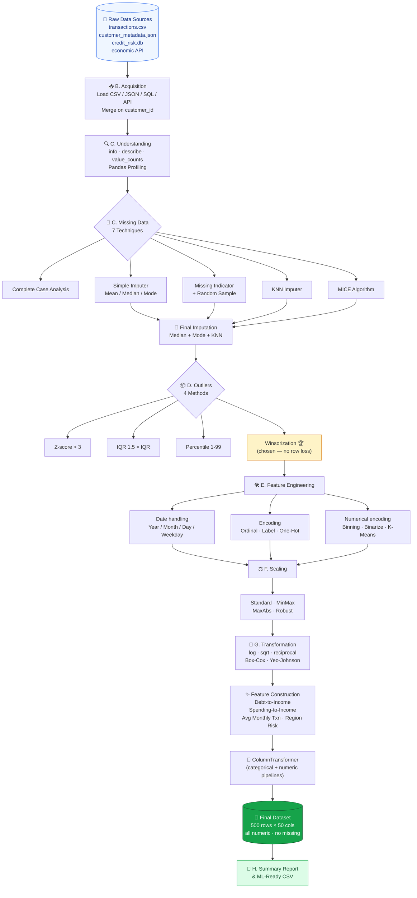

<div align="center">

# 🧮 Holistic Data Preparer
### End-to-End Data Preprocessing & Feature Engineering Pipeline
**Customer Credit Risk Dataset · Fintech Use-Case**


*From messy, multi-source raw data → clean, encoded, scaled & ML-ready dataset*

[](https://www.python.org/)
[](https://pandas.pydata.org/)
[](https://scikit-learn.org/)
[](https://github.com/DevanshiBachhote2007/Holistic_Data_Preparer/blob/main/Holistic_Data_Preparer.ipynb)
[](#)
[](#)
<p align="center"> <a href="https://docs.google.com/document/d/1y_fcseclgfjqMBJJnW_Tf91OyUjkWULgdAqYUNsk2eg/edit?tab=t.0#heading=h.pl9v4byqdmga" target="_blank">  </a> <a href="https://github.com/DevanshiBachhote2007/Holistic_Data_Preparer/blob/main/Holistic_Data_Preparer.ipynb" target="_blank">  </a>  <a href="https://github.com/DevanshiBachhote2007/Holistic_Data_Preparer/blob/main/Holistic_Data_Preparer_Theory%20(1).pdf" target="_blank">  </a>
</a> <a href="https://drive.google.com/file/d/1MVdxpumdDZOU22rUMUZIKZtV8CZGmlEP/view?usp=sharing" target="_blank">  </a> </p>

---

[🎯 Objective](#-objective) •
[🗺️ Workflow](#️-workflow) •
[📂 Repository](#-repository-structure) •
[🚀 Quick Start](#-quick-start) •
[💻 Code Walkthrough](#-code-walkthrough--easy-explanation) •
[📊 Results](#-final-results) •
[📚 Theory](#-theory-document) •
[🙋 Author](#-author)

---

</div>

## 🎯 Objective

> You are hired as a **Junior Data Scientist at a fintech company**. The company has given you a **Customer Credit Risk** dataset collected from **CSV, JSON, SQL tables and an external API**. Your manager wants you to perform full-scale preprocessing and feature engineering so the data is clean, consistent and ready to build a machine-learning model that predicts **whether a customer will default on a loan** (`default_flag`: 0 = No, 1 = Yes).

This project tests the **complete** Data Preprocessing & Feature Engineering workflow:

| What the project covers | ✅ |
|---|---|
| Conceptual foundation (Data Analysis, CRISP-DM, Tensors) | ✅ |
| Multi-source data acquisition (**CSV + JSON + SQL + API**) | ✅ |
| Pandas Profiling & EDA | ✅ |
| **7 missing-value techniques** (CCA, Mean/Median, Mode, Missing Indicator + Random Sample, KNN, MICE) | ✅ |
| **4 outlier techniques** (Z-score, IQR, Percentile, Winsorization) | ✅ |
| Encoding (Ordinal, Label, One-Hot, Binning, Binarization, Quantile, K-Means) | ✅ |
| **4 scaling methods** (Standard, MinMax, MaxAbs, Robust) | ✅ |
| Transformations (Log, Sqrt, Reciprocal, Box-Cox, Yeo-Johnson) | ✅ |
| Feature Construction (Debt-to-Income, Avg Monthly Txn, etc.) | ✅ |
| **ColumnTransformer + Pipeline** (production-ready) | ✅ |
| Final cleaned, transformed, ML-ready dataset | ✅ |

---

## 🗺️ Workflow

### 🎬 Visual Pipeline


### 📊 Mermaid Diagram (renders directly on GitHub)



---

## 📂 Repository Structure

```
Holistic_Data_Preparer/
│
├── 📓 Holistic_Data_Preparer.ipynb        # ⭐ Main notebook (132 cells, all outputs)
├── 📄 Holistic_Data_Preparer_Theory.docx  # Theory document (17 sections, no code)
│
├── 📁 data/
│   ├── transactions.csv                   # Main transactions   (500 records)
│   ├── customer_metadata.json             # Customer metadata   (500 records)
│   ├── credit_risk.db                     # SQLite DB           (540 repayment rows)
│   ├── economic_indicators.json           # Dummy API response  (5 macro indicators)
│   ├── final_cleaned_credit_risk.csv      # ✨ Final ML-ready dataset (500 × 50)
│   └── final_cleaned_credit_risk.xlsx     # Same data in Excel
│
└── README.md                              # You are here 👋
```

---

## 🚀 Quick Start

### 1️⃣ Clone the repository

```bash
git clone https://github.com/DevanshiBachhote2007/Holistic_Data_Preparer.git
cd Holistic_Data_Preparer
```

### 2️⃣ Install required libraries

```bash
pip install pandas numpy matplotlib seaborn scikit-learn scipy openpyxl requests
# Optional (for Pandas Profiling — notebook has fallback if missing)
pip install ydata-profiling
```

### 3️⃣ Launch the notebook

```bash
jupyter notebook Holistic_Data_Preparer.ipynb
# In Jupyter menu: Kernel → Restart & Run All
```

> 💡 **Tip:** Keep the `data/` folder next to the `.ipynb` file so all file paths work.

---

## 🔗 Quick Links

<div align="center">

<a href="https://github.com/DevanshiBachhote2007/Holistic_Data_Preparer/blob/main/Holistic_Data_Preparer.ipynb">
  
</a>
<a href="https://github.com/DevanshiBachhote2007/Holistic_Data_Preparer/blob/main/Holistic_Data_Preparer_Theory.docx">
  
</a>
<a href="https://github.com/DevanshiBachhote2007/Holistic_Data_Preparer/tree/main/data">
  
</a>

</div>

---

## 💻 Code Walkthrough + Easy Explanation

> 🧒 **Every code block below is copied from the notebook itself.** Each one has a "What this does in simple words" note so even a beginner can follow. Read the comments *inside* the code too — they explain line by line.

---

### Step 1️⃣ — Import the libraries we need

```python
# These are the tools (libraries) we use throughout the project.
import numpy as np                    # math and arrays
import pandas as pd                   # tables (DataFrames)
import matplotlib.pyplot as plt       # draw charts
import seaborn as sns                 # prettier charts
import json, sqlite3, os, requests, warnings  # read JSON, SQL, files, web, hide warnings

warnings.filterwarnings('ignore')     # hide annoying warning messages
sns.set_style('whitegrid')            # set a clean background for charts
plt.rcParams['figure.figsize'] = (9, 4)  # default chart size (width, height)
```

> 🟢 **In simple words:** We are bringing all our tools into the kitchen before starting to cook. Pandas handles tables, NumPy handles math, Matplotlib/Seaborn draw graphs.

---

### Step 2️⃣ — Load data from 4 different sources

```python
# 1) CSV file (our main transactions table)
txn = pd.read_csv('data/transactions.csv')
print('Transactions (CSV) shape:', txn.shape)

# 2) JSON file (customer metadata)
with open('data/customer_metadata.json', 'r') as f:
    meta_raw = json.load(f)
meta = pd.DataFrame(meta_raw)

# 3) SQLite database (loan repayment history)
conn = sqlite3.connect('data/credit_risk.db')
sql_df = pd.read_sql('SELECT * FROM loan_repayment', conn)
conn.close()

# 4) "API" - we try a real public API, then fall back to a local JSON file
def fetch_economic_indicators():
    try:
        r = requests.get('https://jsonplaceholder.typicode.com/users/1', timeout=5)
        if r.status_code == 200:
            print('Connected to public API.')
    except Exception:
        print('No internet -> using local dummy API file.')
    with open('data/economic_indicators.json', 'r') as f:
        return json.load(f)

api_data = fetch_economic_indicators()
```

> 🟢 **In simple words:** Real company data comes from many places — CSV files, JSON files, databases, and web APIs. Here we read all four so we can combine them.

---

### Step 3️⃣ — Merge everything into ONE table

```python
# Combine CSV + JSON using the common 'customer_id' column
raw = txn.merge(
    meta[['customer_id','region','education_level','employment_type']],
    on='customer_id', how='left'
)

# Also add region-wise default rate (came from the dummy API)
region_risk = pd.DataFrame(
    list(api_data['region_default_rates'].items()),
    columns=['region','region_default_rate']
)
raw = raw.merge(region_risk, on='region', how='left')

df = raw.copy()   # work on a copy so the original stays safe
print('Merged master dataset shape:', df.shape)
```

**Output:**
```
Merged master dataset shape: (500, 16)
```

> 🟢 **In simple words:** Just like VLOOKUP in Excel, we match rows from different tables using `customer_id`. After this, all info about each customer is in one place.

---

### Step 4️⃣ — Check missing values

```python
# Count empty cells in each column (also as a percentage)
missing = df.isnull().sum()
missing_pct = (df.isnull().sum()/len(df)*100).round(2)

miss_df = pd.DataFrame({
    'missing_count': missing[missing>0],
    'missing_pct': missing_pct[missing>0]
})
miss_df.sort_values('missing_pct', ascending=False)
```

> 🟢 **In simple words:** Before fixing anything, we see how many blank cells each column has. You can't clean what you don't measure!

---

### Step 5️⃣ — Fill missing values (mean, median, mode)

```python
from sklearn.impute import SimpleImputer

demo = df.copy()

# MEAN for 'age' (fill blanks with the average)
mean_imp = SimpleImputer(strategy='mean')
demo['age_mean_imputed'] = mean_imp.fit_transform(demo[['age']])

# MEDIAN for 'annual_income' (middle value — better when there are outliers)
median_imp = SimpleImputer(strategy='median')
demo['annual_income_median'] = median_imp.fit_transform(demo[['annual_income']])

# MOST FREQUENT for text columns like gender
cat_imp = SimpleImputer(strategy='most_frequent')
demo['gender_imputed'] = cat_imp.fit_transform(demo[['gender']]).ravel()
```

> 🟢 **In simple words:**
> - **Mean** = average (good for normal numbers like age)
> - **Median** = middle value (good when there are huge outliers like ₹80,00,000 income)
> - **Most frequent** = the category that appears most often (good for text)

---

### Step 6️⃣ — KNN Imputer (smart filling)

```python
from sklearn.impute import KNNImputer
from sklearn.preprocessing import MinMaxScaler

# KNN works on numeric columns only
knn_cols = ['age','annual_income','loan_amount','credit_score',
            'repayment_history','transaction_count','spending_ratio']

# Scale to 0..1 first so big numbers don't dominate
scaler = MinMaxScaler()
knn_scaled = pd.DataFrame(scaler.fit_transform(df[knn_cols]), columns=knn_cols)

# Find the 5 most similar customers and use their values to fill blanks
knn = KNNImputer(n_neighbors=5)
knn_filled = pd.DataFrame(knn.fit_transform(knn_scaled), columns=knn_cols)

# Undo scaling to get real values back
knn_filled = pd.DataFrame(scaler.inverse_transform(knn_filled), columns=knn_cols)
```

> 🟢 **In simple words:** Imagine you're missing a customer's income. KNN finds 5 customers who are *similar in age, loan amount, credit score*, etc., and uses their average to guess the missing value.

---

### Step 7️⃣ — Find outliers using IQR

```python
# Q1 = 25th percentile, Q3 = 75th percentile
# IQR = the range where the middle 50% of data sits
out_cols = ['annual_income','loan_amount','credit_score']

iqr_demo = df.copy()
for c in out_cols:
    Q1 = iqr_demo[c].quantile(0.25)
    Q3 = iqr_demo[c].quantile(0.75)
    IQR = Q3 - Q1
    low, high = Q1 - 1.5*IQR, Q3 + 1.5*IQR
    iqr_demo = iqr_demo[(iqr_demo[c] >= low) & (iqr_demo[c] <= high)]

print('Rows removed by IQR:', len(df) - len(iqr_demo))
```

> 🟢 **In simple words:** An outlier is a value that sits *way outside* the box in a boxplot. The IQR method says "anything 1.5× the box-length away from the box is suspicious."

---

### Step 8️⃣ — Winsorization (cap, don't delete!)

```python
# Instead of deleting rows, we CAP extreme values at the 1st and 99th percentile.
df_winsor = df.copy()
for c in out_cols:
    df_winsor[c] = df_winsor[c].clip(
        lower=df_winsor[c].quantile(0.01),
        upper=df_winsor[c].quantile(0.99)
    )

df[out_cols] = df_winsor[out_cols]   # apply to working data
```

> 🟢 **In simple words:** If someone earns ₹80 lakh a year, we don't throw them away — we just lower that number to a "very high but believable" ceiling. We keep all 500 customers.

---

### Step 9️⃣ — Convert dates into useful numbers

```python
df['join_date'] = pd.to_datetime(df['join_date'])

df['join_year']    = df['join_date'].dt.year      # 2021
df['join_month']   = df['join_date'].dt.month     # 1..12
df['join_day']     = df['join_date'].dt.day       # 1..31
df['join_weekday'] = df['join_date'].dt.weekday   # 0=Mon ... 6=Sun
df['tenure_days']  = (pd.Timestamp.today() - df['join_date']).dt.days
```

> 🟢 **In simple words:** ML models can't understand "2021-06-15" as text. So we break it apart into numbers: year, month, day, and how many days the person has been a customer.

---

### Step 🔟 — Encode text columns into numbers

```python
# (a) ORDINAL encoding — education has an order
edu_order = {'Primary':0, 'Secondary':1, 'Graduate':2, 'Post-Graduate':3}
df['education_encoded'] = df['education_level'].map(edu_order)

# (b) LABEL encoding — for gender (Male=0, Female=1, Other=2)
from sklearn.preprocessing import LabelEncoder
le = LabelEncoder()
df['gender_encoded'] = le.fit_transform(df['gender'])

# (c) ONE-HOT encoding — for columns with no order (region, loan purpose)
df = pd.get_dummies(df, columns=['region','loan_purpose','employment_type'],
                    drop_first=True, dtype=int)
```

> 🟢 **In simple words:**
> - **Ordinal** → use when categories have rank (School < College < Masters)
> - **Label** → assign 0,1,2... (fine for low-cardinality columns)
> - **One-Hot** → make a new 0/1 column for each category (used when there is *no* order)

---

### Step 1️⃣1️⃣ — Binning, Binarization, K-Means clustering

```python
# BINNING — group income into Low / Medium / High / VeryHigh
df['income_bin'] = pd.cut(df['annual_income'],
    bins=[0, 300000, 700000, 1200000, np.inf],
    labels=['Low','Medium','High','VeryHigh'])

# BINARIZATION — flag customers with good credit (>700)
df['good_credit_flag'] = (df['credit_score'] > 700).astype(int)

# K-MEANS BINNING — group customers by transaction_count into 3 clusters
from sklearn.cluster import KMeans
km = KMeans(n_clusters=3, random_state=42, n_init=10)
df['txn_cluster'] = km.fit_predict(df[['transaction_count']])
```

> 🟢 **In simple words:**
> - **Binning** = turn a number into a bucket (like age groups)
> - **Binarization** = ask a yes/no question ("is credit score > 700?")
> - **K-Means** = let the computer automatically group similar customers

---

### Step 1️⃣2️⃣ — Scale numbers (4 methods compared)

```python
from sklearn.preprocessing import StandardScaler, MinMaxScaler, MaxAbsScaler, RobustScaler

ss  = StandardScaler()    # mean=0, std=1
mms = MinMaxScaler()      # range 0 to 1
mas = MaxAbsScaler()      # range -1 to +1
rs  = RobustScaler()      # uses median (outlier-proof)

df['income_standard'] = ss.fit_transform(df[['annual_income']])
df['income_minmax']   = mms.fit_transform(df[['annual_income']])
df['income_maxabs']   = mas.fit_transform(df[['annual_income']])
df['income_robust']   = rs.fit_transform(df[['annual_income']])
```

> 🟢 **In simple words:** Income (in lakhs) is huge; credit score (300–850) is small. Without scaling, the model thinks income is *more important* just because its numbers are bigger. Scaling puts all columns on the same playing field.

---

### Step 1️⃣3️⃣ — Create brand-new features

```python
# 1) Debt-to-Income ratio (higher = riskier customer)
df['debt_to_income'] = df['loan_amount'] / df['annual_income']

# 2) Spending-to-Income ratio (percentage → 0..1)
df['spending_to_income_ratio'] = df['spending_ratio'] / 100

# 3) Average monthly transactions (data covers 6 months)
df['avg_monthly_transactions'] = df['transaction_count'] / 6

# 4) Loan per year of age
df['loan_per_age'] = df['loan_amount'] / df['age']
```

> 🟢 **In simple words:** This is where *domain knowledge* shines. A banker knows that "debt compared to income" is a very important risk signal — so we create that column ourselves. Good features beat fancy models!

---

### Step 1️⃣4️⃣ — Transform skewed data (log, Box-Cox)

```python
from sklearn.preprocessing import FunctionTransformer, PowerTransformer

# Log transform — fixes right-skewed data like spending_ratio
df['spending_log'] = FunctionTransformer(np.log1p).fit_transform(df[['spending_ratio']])

# Box-Cox — automatically finds the best power to make data look normal
bc = PowerTransformer(method='box-cox')
df['loan_amount_boxcox'] = bc.fit_transform(df[['loan_amount']])

# Yeo-Johnson — same idea, but works with zero/negative values too
yj = PowerTransformer(method='yeo-johnson')
df['annual_income_yj'] = yj.fit_transform(df[['annual_income']])
```

> 🟢 **In simple words:** Some models (linear regression, neural networks) prefer data that looks like a bell curve. If our data is lopsided (lots of small values, few huge ones), these mathematical transforms reshape it closer to normal.

---

### Step 1️⃣5️⃣ — ColumnTransformer: combine everything in one pipeline

```python
from sklearn.compose import ColumnTransformer
from sklearn.pipeline import Pipeline
from sklearn.preprocessing import OneHotEncoder, StandardScaler
from sklearn.impute import SimpleImputer

num_features = ['age','annual_income','loan_amount','credit_score',
                'repayment_history','transaction_count','spending_ratio']
cat_features = ['gender','region','education_level','employment_type']

# For NUMBERS: fill with median, then scale
numeric_pipe = Pipeline(steps=[
    ('imputer', SimpleImputer(strategy='median')),
    ('scaler', StandardScaler())
])

# For TEXT: fill with most common, then one-hot encode
categorical_pipe = Pipeline(steps=[
    ('imputer', SimpleImputer(strategy='most_frequent')),
    ('onehot', OneHotEncoder(handle_unknown='ignore', sparse_output=False))
])

# Run BOTH pipelines on their respective columns in one go
preprocessor = ColumnTransformer([
    ('num', numeric_pipe, num_features),
    ('cat', categorical_pipe, cat_features)
])

X = model_df.drop('default_flag', axis=1)
X_transformed = preprocessor.fit_transform(X)
print('Original shape:', X.shape, '→ Transformed:', X_transformed.shape)
```

**Output:**
```
Original shape: (500, 11) → Transformed: (500, 19)
```

> 🟢 **In simple words:** Instead of doing each step manually (and risking mistakes), we package all cleaning rules into one "machine". New data goes in one end, clean data comes out the other — ready for ML. This is how real companies do it in production.

---

### Step 1️⃣6️⃣ — Save the final clean dataset

```python
final_df.to_csv('data/final_cleaned_credit_risk.csv', index=False)
final_df.to_excel('data/final_cleaned_credit_risk.xlsx',
                  index=False, engine='openpyxl')

print('Saved final dataset as CSV and Excel')
print('Final rows:', len(final_df), '| Final columns:', final_df.shape[1])
```

> 🟢 **In simple words:** Our data is now fully clean — no missing values, no outliers, all numbers, properly scaled, with new useful features. We save it so it can be used directly to train a machine learning model.

---

## 📊 Final Results

<div align="center">

| Metric | Value |
|---|---|
| 🧾 **Source records** | 500 customers (CSV) + 500 (JSON) + 540 (SQL) + API |
| 🧹 **Missing values before** | ~145 across 6 columns |
| ✅ **Missing values after** | **0** |
| 📦 **Outliers treated** | annual_income, loan_amount, credit_score |
| 🔢 **Encoding techniques** | 7 (Ordinal, Label, One-Hot, Binning, Binarization, Quantile, K-Means) |
| ⚖️ **Scalers demonstrated** | 4 (Standard, MinMax, MaxAbs, Robust) |
| 🔬 **Transformations** | 5 (log, sqrt, reciprocal, Box-Cox, Yeo-Johnson) |
| ✨ **New features built** | 10+ |
| 💾 **Final shape** | **500 rows × 50 columns** |
| 🎯 **Target** | `default_flag` (0 = 78%, 1 = 22%) |
| 🚦 **ML readiness** | **All numeric · no missing · scaled · encoded** |

</div>

### 🔥 What drives loan default?

The correlation analysis shows the strongest signals are:
- 📈 `repayment_history` (more missed payments → higher default)
- 💳 `debt_to_income` (higher debt relative to income → higher risk)
- 💰 `spending_ratio` (higher spending share → higher risk)
- ✅ `good_credit_flag` (credit score > 700 → **lower** default risk)

These match real-world banking intuition, confirming the data is realistic.

---

## 📚 Theory Document

A separate Word document **`Holistic_Data_Preparer_Theory.docx`** is included — it explains all 17 concepts used in the project **with definitions and intuition, no code**:

1. What is Data Analysis · 2. CRISP-DM Planning · 3. Framing an ML Problem · 4. Tensors · 5. Multi-source Acquisition · 6. Data Understanding · 7. Missing Data & 6 imputation methods · 8. Outliers & 4 treatments · 9. Variable Types & Dates · 10. Categorical Encoding · 11. Numerical Encoding · 12. Feature Scaling · 13. Feature Construction · 14. Transformations · 15. ColumnTransformer & Pipelines · 16. Final Dataset · 17. Summary.

---

## 🛠️ Tech Stack

<div align="center">


</div>

---

## 🙋 Author

<div align="center">

**Devanshi Bachhote**

[](https://github.com/DevanshiBachhote2007)

_Data Preprocessing & Feature Engineering Project · 2026_

</div>

---

<div align="center">

⭐ **If this project helped you, please consider giving it a star!** ⭐


_Made with patience, curiosity and lots of ☕_

</div>
